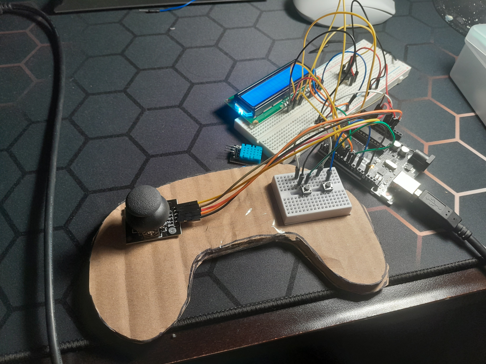

I wanna play Enter the Gungeon on ps4 but im broke – so i made it

Using Arduino UNO, I made a fully working Playstation controller complete with a joystick, buttons and LCD display for game actions. 
I also used Pygame to make a Enter the Gungeon style 2d game with pixel artstyle by rendering small, then upscaling. 

Components used : 
- Arduino UNO R3
- I2C LCD
- 4 pin buttons
- Joystick module
- jumper cables

Coded with Arduino IDE and PyGame
